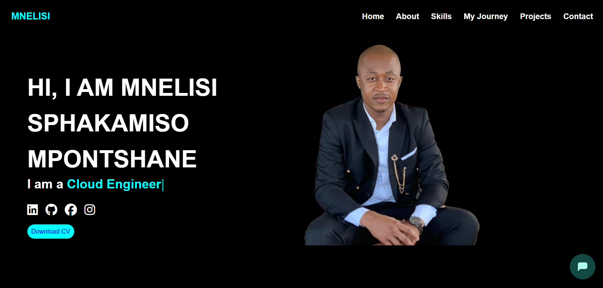

# Mnelisi_Portfolio

Welcome to my personal portfolio! This website highlights my projects, skills, experience, and background in Information Technology. It's a professional platform where potential employers, clients, and collaborators can explore my work and get in touch with me.

#🚀 Features:

About Me: A brief introduction to who I am and my career goals.

Projects: A collection of my completed and ongoing projects, including web apps, mobile apps, and networking solutions.

Skills: A summary of my technical and professional.

Experience: An overview of my professional history, work experience, and certifications.

AI Bot: An AI-driven chatbot to answer any questions about me.

Contact: Simple ways to reach out for collaboration or inquiries.

## 👨‍💻 About Me
 
I'm Mnelisi Mpontshane! I'm passionate about technology, especially software development and cloud engineering, with a strong focus on Google Cloud.
I love staying up to date with the latest tech trends and exploring innovative solutions that make an impact. Whether it’s building scalable applications or diving into the cloud, I’m always excited to learn, create, and grow.
 
 
## 🛠 Technologies Used
 
Frontend
HTML5: Semantic markup for structure and accessibility

CSS3: Styling with modern features like Flexbox and Grid

JavaScript: For interactive elements and dynamic content
 
 
Other Tools used for development: GitHub, VS Code
 
## 📂 Project Structure
 
portfolio/
├── index.html
│   ├── css/
│   ├── images/
│   ├── js/
└── README.md
 
 
## 🎯 Future Enhancements
 
Add a blog section to share insights and tutorials , database and ai enhancments.
 
Implement animations and transitions for a more interactive experience.
 
Integrate a contact form with backend email functionality.
 
## 📬 Contact
 
Feel free to connect with me:
 
📧 Email: mpontshanemnelisi2002@gmail.com

🔗 LinkedIn: https://www.linkedin.com/in/mnelisi21

🔗 Github: https://github.com/Mnelisi-Writes

## Link to Deployed Website

🌐 Portfolio: https://mnelisi-writes.github.io/Mnelisi_Portfolio/
